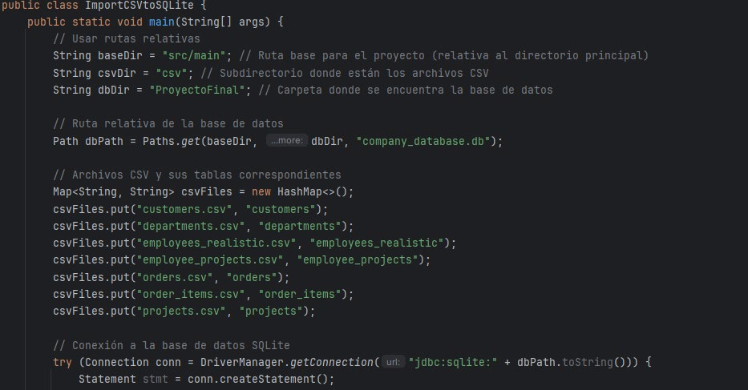

# Nota: este readme está hecho con un conversor pdf a markdown, es posible que su visualización contenga errores.

# Página 1

Funcionalidad: 
0. Asumimos que tenemos instalado Python (y está añadido a PATH) y un IDE de Java 
como IntelliJ IDEA o NetBeans 
 
1. Ejecutamos el archivo “a.ImportarCSVaSQLite.py” ubicado en src/main/csv para crear 
la base de datos SQLite (company_database.db, se creará en la ruta del proyecto) e 
importar los archivos .csv a la base de datos. En caso de que no estén todos los 
archivos ("customers.csv", "departments.csv", "employees_realistic.csv", 
"employee_projects.csv", "orders.csv", "order_items.csv", "projects.csv") la 
importación no se efectuará. 
 
En caso de fallo porque Python no funcione, podemos ejecutar el archivo 
“ImportCSVtoSQLite.java” y ocurrirá lo mismo. 
2. Las consultas pedidas se han realizado en archivos .sql 
(“b.ConsultarInformacionProyecto.sql”, “CalcularCostosSalarialesPorProyecto.sql”, 
“CombinarCostosConPresupuesto.sql” y 
“e.CalcularFraccionPresupuestoCostosSalariales.sql”). 
3. En el archivo “SQLiteJDBCFullQueries.java” se encuentran las consultas mencionadas 
previamente que se ejecutan utilizando JBDC. 
Lo ejecutamos y obtenemos lo siguiente: 
ResultadoSQLiteJDBCFullQueries.java.txt
 
4. En el archivo “HibernateSQLiteFullQueries.java” se encuentran las consultas 
mencionadas previamente que se ejecutan utilizando Hibernate. 
Lo ejecutamos y obtenemos lo siguiente: 
ResultadoHibernateSQLiteFullQueries.java.txt
 

# Página 2

5. Para mejorar la visualización de los datos, contamos con la clase 
“QuerySelectorGUI.java”, que, al ejecutarla, nos ofrece una GUI de Java Swing donde: 
a. Podemos seleccionar si usar JDBC o Hibernate para la consulta a realizar: 
 
b. Independientemente de cuál seleccionemos, nos mostrará la siguiente lista de 
consultas disponibles: 
 
 
 
 
 

# Página 3

c. Seleccionaremos la 3.d: Primero en JDBC, y luego en Hibernate 
En JDBC se ven los nombres de las columnas: 
 
En Hibernate no se ven los nombres de las columnas, puesto que hibernate 
trabaja con objetos y no tiene un método de acceder al nombre de las 
columnas:  
 
 
 
 

# Página 4

Documentación del código 
Importación de Datos 
a. ImportarCSVaSQLite.py 
Este script en Python utiliza pandas para leer archivos CSV y sqlite3 para insertar los datos en 
una base de datos SQLite. 
 
b. ImportCSVtoSQLite.java 
Esta clase Java lee archivos CSV desde un directorio específico y los inserta en la base de datos 
SQLite utilizando JDBC. 
Captura del main: 
 
 

# Página 5

Captura de la sentencia SQL para inserción: 
 
Configuración de Maven 
pom.xml 
Este archivo contiene las configuraciones y dependencias necesarias para el proyecto, 
incluyendo Hibernate y SQLite JDBC Driver. 
Captura del bloque <dependencies> de pom.xml: 
 
Captura del bloque <repositories> de pom.xml: 
 

# Página 6

Configuración de Hibernate: 
hibernate.cfg.xml 
Este archivo XML configura Hibernate para conectar con la base de datos SQLite y mapear las 
clases en entidades/objetos. 
Captura del bloque <session-factory> de hibernate.cfg.xml: y captura de las etiquetas 
<mapping class="..."/>: 
 
Clases de Hibernate 
SessionFactoryProvider.java 
Esta clase proporciona una instancia única de SessionFactory. 
Captura del método provideSessionFactory() de SessionFactoryProvider.java: 
 
Consultas con JDBC y Hibernate 
SQLiteJDBCFullQueries.java 
Este script Java contiene consultas SQL directas a la base de datos SQLite para unir tablas, 
calcular costos salariales, combinar costos con presupuesto y calcular fracciones del 
presupuesto. 
Captura del bloque try donde se ejecutan las consultas (de una consulta específica joinQuery): 
 

# Página 7

 
HibernateSQLiteFullQueries.java 
Esta clase Java utiliza Hibernate para realizar consultas similares a las realizadas con JDBC. 
Captura de la definición de las entidades (EmployeeProject, EmployeeRealistic, Project): 
 
  
Captura del método unirTablas(), que realiza la primera consulta (3.a) utilizando Hibernate: 
 

# Página 8

Interfaz Gráfica (GUI) 
QuerySelectorGUI.java 
Esta clase Java crea una interfaz gráfica utilizando Java Swing que permite al usuario 
seleccionar el modo de consulta (JDBC o Hibernate) y ejecutar diferentes consultas. 
Captura del método createAndShowGUI(): 
 
 
 
 
 
 
 

# Página 9

Captura del método showQueryPanel(JFrame frame, String mode): 
 

# Página 10

Captura de los métodos para ejecutar Query (con JDBC o Hibernate): 
 

